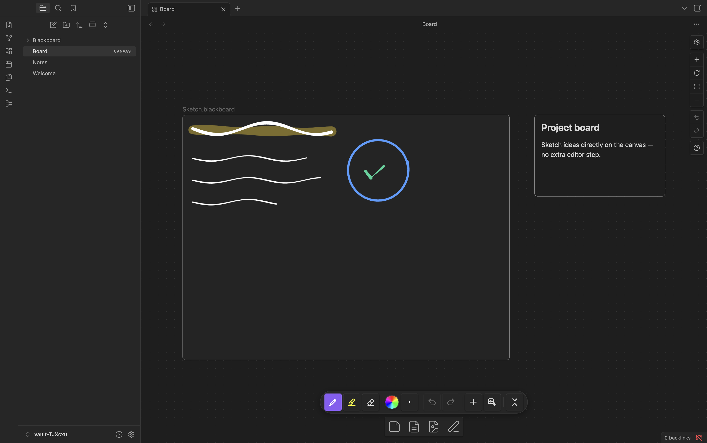
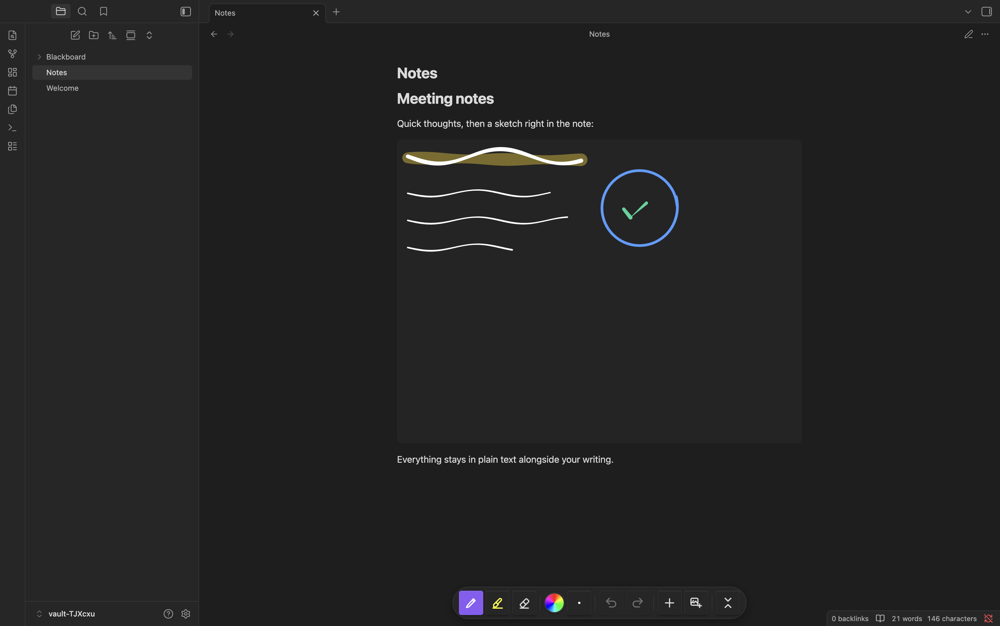
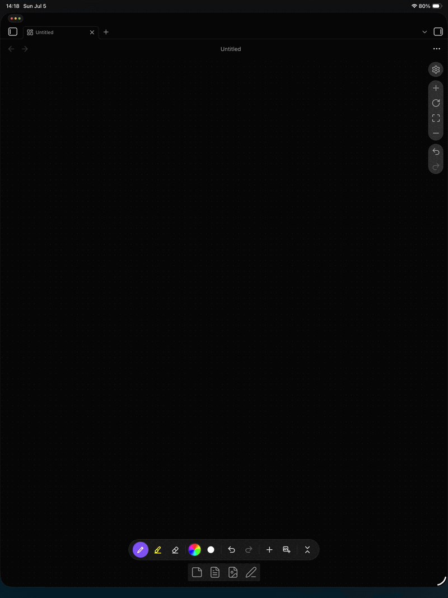
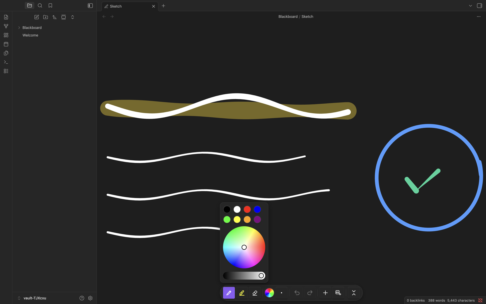
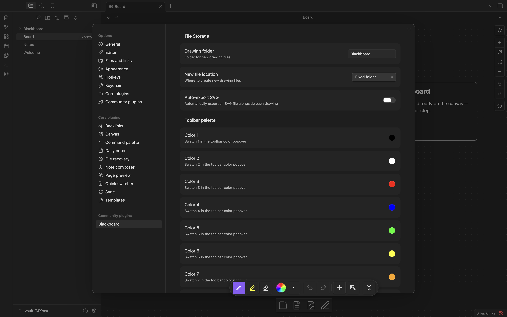

# Blackboard Drawing Tool

Blackboard Drawing Tool adds handwriting and drawing boards to your notes, Markdown embeds, and Canvas cards. Use a mouse or stylus to draw, add text labels and shapes, and select content on a shared drawing surface.

## Fork notice

This is a fork of [Blackboard](https://github.com/jameswolensky/obsidian-blackboard) by James Wolensky (MIT). It is substantially modified and not affiliated with or endorsed by the original author.

## What's different from upstream

- A text tool with editable, movable labels stored inside the drawing and included in SVG exports. Older text sidecars are imported on first open.
- Physical-key shortcuts: **Q** for pen, **E** for eraser, and **T** for text, including on non-Latin keyboard layouts. Custom command bindings take precedence.
- Line, arrow, rectangle, and ellipse tools, plus marquee selection to move, recolor, or delete strokes and labels together.
- A **Draw drawing area** command: drag a rectangle in the source editor to insert a drawing of that size.
- Guards against an untouched empty view overwriting an existing board, and against teardown clearing saved content.
- A canvas rendering fix for invisible committed strokes caused by desynchronized canvas compositing.

## Features / usage

Create a board with **Blackboard Drawing Tool: New drawing** in the command palette. Use **Insert drawing** or **Insert existing drawing** in a note or Canvas. Drawing files use the `.blackboard` extension and can also be opened directly.

Embed a board in Markdown with `![[Drawing.blackboard]]`. Set an explicit embed size with `![[Drawing.blackboard|600x400]]` or `![[Drawing.blackboard|80%]]`.

The floating toolbar offers pen, highlighter, eraser, text, selection, and shape tools, with color and size controls and undo/redo. In text mode, click the board to add a label. Select the selection tool and drag a rectangle around strokes or labels to work with them as a group. Q/E/T switch tools while working on a drawing and do not intercept typing. Tool commands can also be bound in **Settings -> Hotkeys**.

Settings include the drawing folder, board background, toolbar palette, optional shape recognition, and automatic SVG export. Text is stored in the `.blackboard` file; plugin preferences are stored separately in the plugin's `data.json`.

Screenshots are from the original Blackboard; the fork's UI differs slightly.







## Moving and wrapping boards

Hover or focus a board to reveal its frame controls (always visible on touch screens). In **Live Preview**, drag the grip to move the embed token between top-level blocks. A horizontal indicator marks a valid drop. The pane scrolls near its edges; **Escape** cancels. **Move up / Move down** buttons and commands move one block at a time. For an inline board, the first press extracts it above/below the **whole containing top-level block** (the whole list or callout). Later presses cross one block. Commands have no default hotkeys. In **Source mode**, put the cursor inside the board's embed token, especially when two embeds share a line.

Inline boards in paragraphs, nested list items and blockquotes/callouts are supported, including glued pairs such as `Text.![[A.blackboard]]![[B.blackboard]]`. Moving extracts just the selected token; it removes exactly one adjacent space (preferring the preceding space) and preserves punctuation and the other embed. **Put on its own line** extracts after the whole containing block; use its frame button, grip context menu, or **Blackboard: put board on its own line** command. Selecting left/right on an inline board extracts **before** the containing block and writes its layout in one transaction, so the following text can wrap. Center changes the alias in place.

Code (including backticks), note properties/frontmatter, tables, enclosing link/wiki syntax and unresolved duplicate occurrences are refused with an actionable Notice. Unsupported opaque Markdown (for example HTML blocks or an unclosed code fence) still causes a conservative refusal. Drops inside protected blocks or another embed line are refused. Whole lists, tables and code blocks can be crossed without splitting their content. A move, extraction, combined extraction/layout change or resize is one isolated editor undo step; moving to the same place writes nothing. Resize and layout changes require an editable note; Reading-view controls are read-only. Canvas nodes have none of the move or wrap controls.

Use **Center**, **Board left, text on the right**, or **Board right, text on the left** in the frame. Layout and size are separate pipe-delimited alias tokens:

```md
![[Drawing.blackboard]]
![[Drawing.blackboard|left|400x300]]
![[Drawing.blackboard|right|100%x400]]
```

Token order is flexible on read; edits write layout before size. Center is the default and is omitted on write. Unknown tokens survive rewrites; conflicting layout or size tokens are refused. Resizing preserves layout. All existing size aliases (`640x480`, `300`, `100%`, `100%x400`) remain supported.

**Reading view and PDF export** float left/right boards, capped at 60% of the note width, with headings clearing the wrap and floats contained within the note. Following lists get a formatting context to keep their markers beside the board. Panes narrower than 500px center boards automatically without changing their aliases. By default, **Live Preview** centers the board and displays a clickable `wrap: right — shown in Reading view` badge (or left). Click it to open the plugin settings.

**Wrap text around boards while editing (experimental)** is off by default. Turning it on applies real floats in Live Preview and requests CM6 remeasurement after layout changes and board/pane resize. This opt-in can affect caret mapping, selection and scrolling: turn it off if those become unstable. Offline fixtures verify CSS and browser geometry; Obsidian runtime editing and PDF checks still need owner verification. To rerun the installed-Chrome offline fixture, use `node scripts/check-wrap-fixture.mjs` (no downloads; output in ignored `release/wrap-fixture/`).

## Installation

### BRAT (recommended)

1. Install and enable **BRAT** from Obsidian's community plugins.
2. In BRAT, choose **Add Beta plugin** and enter `myhobbie123/obsidian-blackboard-drawing-tool`.
3. Enable **Blackboard Drawing Tool** in your installed plugins.

### Manual

Download `main.js`, `manifest.json`, and `styles.css` from the [latest GitHub Release](https://github.com/myhobbie123/obsidian-blackboard-drawing-tool/releases/latest). Put all three files in `<vault>/.obsidian/plugins/blackboard-text/`, reload Obsidian, and enable **Blackboard Drawing Tool**.

Do not enable this fork and the original Blackboard together in the same vault. Their plugin IDs differ, but both register the `blackboard-view` view type and `.blackboard` file extension, so they conflict.

## Data & privacy

The production plugin makes no network requests and includes no telemetry. Drawings, labels, settings, and SVG exports stay in your vault; any syncing is managed by your own vault setup. File deletion initiated by the plugin uses Obsidian's trash handling and follows your trash settings. Erasing strokes or labels edits the drawing and can be undone with the drawing's undo controls.

## Building from source

Use **Node.js 24**, as specified in `.nvmrc`.

```sh
npm ci
npm run build
npm run check
```

`npm run check` runs typechecking, lint, unit tests, and a production build. The build writes the ignored root `main.js` with the license and third-party notices retained; `manifest.json` and `styles.css` are shipped directly from the repository. Development builds include a local reload bridge; production builds exclude it.

See [CONTRIBUTING.md](CONTRIBUTING.md) for local development.

## Releasing

Bump the version in `package.json`, the two root version fields in `package-lock.json`, and `manifest.json`, and add its minimum app version to `versions.json`. Alternatively, `npm version <version> --no-git-tag-version` updates these through the version hook. Run `npm run check`, commit the changes, then create a tag equal to the manifest version with **no `v` prefix** and push that tag. The release workflow validates the version, builds and attests the assets, and attaches `main.js`, `manifest.json`, and `styles.css` to the GitHub Release.

Distribution is through GitHub Releases and BRAT; this fork is not submitted to the community plugin catalog.

## License & credits

[MIT](LICENSE). Original work &copy; 2026 James Wolensky; fork changes &copy; 2026 Tatyana. Bundled third-party packages and their licenses are listed in [NOTICE](NOTICE).
